# AT Commands for iMCP HT32SX

<a name="terminal_setup"></a>
## 1 - Serial Terminal Setup:

* Baud rate: 115200
* Data bits: 8
* Stop bits: 1
* Parity: none
* Flow Control: none
* **Transmitted text: Append Nothing**

<hr>

[Termite](https://www.compuphase.com/software_termite.htm) setup example:

<div align="center">
    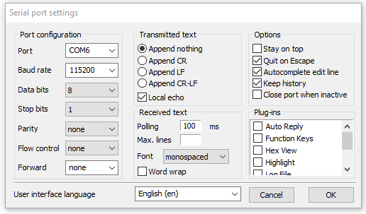
</div>
<div align="center"> Figure 1.1 - Termite setup. </div>

<br/>

<hr>

## 2 - Command Table:

<br/>

<span style="color:red">**WARNING:**</span> The end line character (';') must be added at the end of all commands!

<br/>

<a name="tab_1"></a>
<div align="center"> Table 1.2 - Available Commands. </div>

| Command | Argument | Description |
|:-------------------:|:-------------------|:------------|
| [AT+IDPAC](#id_pac) | **None** | Get device ID and PAC. More details can be found at [Section 4](#cmd_details).<br/><br/>**Example:** AT+IDPAC;|
| [AT+CFGRCZ](#cfgrcz) | **RCZ:** Sigfox Network RC Zone. | Open SigFox library according to the region. More details can be found at [Section 4](#cmd_details).<br/><br/>**Example 1:** AT+CFGRCZ=2; |
| [AT+SEND](#send) | **DOWNLINK_FLAG:** Set this flag to 1 in order to ask for a downlink.<br/><br/>**PAYLOAD:** Payload that will be sent to the SigFox Network. It must be less or equal than 12 bytes. | Send a payload to the SigFox Network. **_Before calling this function, it is necessary to call the AT+CFGRCZ first._** More details can be found at [Section 4](#cmd_details).<br/><br/>**Example 1:** AT+SEND=1:AAAAAAAA; (Wait for a downlink).<br/>**Example 2:** AT+SEND=0:AAAAAAAA; (Do not wait for a downlink). |
| [AT+SENDCRC](#sendcrc) | **DOWNLINK_FLAG:** Set this flag to 1 in order to ask for a downlink.<br/><br/>**PAYLOAD:** Payload that will be sent to the SigFox Network. It must be less or equal than 12 bytes.<br/><br/>**CRC32:** 32 bits CRC of the respective payload in **ASCII**. | Send a payload to the SigFox Network and check the CRC of the payload. **_Before calling this function, it is necessary to call the AT+CFGRCZ first._** More details can be found at [Section 4](#cmd_details).<br/><br/>**Example 1:** AT+SENDCRC=1:00112233445566778899AABB:3138A376;<br/>**Example 2:** AT+SENDCRC=0:00112233445566778899AABB:3138A376; |
| AT+SENDBIT | **DOWNLINK_FLAG:** Set this flag to 1 in order to ask for a downlink.<br/><br/>**BIT:** Bit value that is going to be sent to the Sigfox Network **(must be 0 or 1)**. | Send a single bit to the SigFox Network. **_Before calling this function, it is necessary to call the AT+CFGRCZ first._** More details can be found at [Section 4](#cmd_details).<br/><br/>**Example 1:** AT+SENDBIT=0:0;<br/>**Example 2:** AT+SENDBIT=0:1; |
| [AT+MONARCH](#monarch) | **RCZ:** RC beacon expected (in order to scan every region available, the RCZ value should be 127).<br/>**TIMEOUT:** Timeout in minutes. It is recommended to use at least 5 minutes of timeout. | Scan a Monarch Beacon and returns the region found. **_The library must be closed before use this command (command AT+CLOSE)._** More details can be found at [Section 4](#cmd_details).<br/><br/>**Example 1:** AT+MONARCH=2:5; (scan only RC2 beacons). <br/>**Example 2:** AT+MONARCH=127:5; |
| AT+STPMONARCH | **None** | Stop an already running Monarch Scan. Returns 0x0000 if ok.<br/>**Example:** AT+STPMONARCH; |
| AT+CTMICRO | **MICROCHANNEL:** Microchannel number from 1 to 54. | Starts a continuous transmission in a microchannel. Returns 0x0000 if ok. This is one of the Anatel Certification commands. More details can be found at [Section 5](#anatel_details)<br/><br/>**Example:** AT+CTMICRO=1;<br/>**Example:** AT+CTMICRO=54; |
| AT+CTMACRO | **MACROCHANNEL:** Macrochannel number from 1 to 9. | Starts a continuous transmission in a macrochannel. Returns 0x0000 if ok. This is one of the Anatel Certification commands. More details can be found at [Section 5](#anatel_details)<br/><br/>**Example:** AT+CTMACRO=1;<br/>**Example:** AT+CTMACRO=9; |
| AT+FRQPHOPP | **None** | Starts a frequency hopping test. This is one of the Anatel Certification commands. More details can be found at [Section 5](#anatel_details)<br/><br/>**Example:** AT+FREQPHOPP; |
| AT+TESTCRED | **FLAG:** 1 enable, 0 disable the test mode. | Configures device to operate in test mode, using its test Sigfox Credentials. This is one of the Anatel Certification commands. More details can be found at [Section 5](#anatel_details)<br/><br/>**Example 1:** AT+TESTCRED=1;<br/>**Example 2:** AT+TESTCRED=0; |
| AT+CLOSE | **None** | This command closes the SigFox library (Free the allocated memory of SIGFOX_API_open and close RF).<br/><br/>**Example:** AT+CLOSE; |
| AT+RESET | **None** | Soft reset. | **Example:** AT+RESET; |
| [AT+DEEPSLEEP](#deepsleep) | **None** | HT32SX low power state.<br/><br/>**Example:** AT+DEEPSLEEP; |
| AT+SWITCHPA | **PA_EN:** 1 to enable and 0 to disable. | Turns the power amplifier on/off. More details can be found at [Section 4](#cmd_details).<br/><br/>**Example 1** (PA ON): AT+SWITCHPA=1;<br/>**Example 2** (PA OFF): AT+SWITCHPA=0; |
| AT+SWITCHBOOST |  **BOOST_EN:** Enable/disable boost mode. | Enable/disable S2LP boost mode.<br/><br/>**Example 1** (Boost Enable): AT+SWITCHBOOST=1;<br/>**Example 2** (Boost Disable): AT+SWITCHBOOST=0; |
| AT+REDUCEPOWER | **REDUCE_VALUE:** Reduce factor. | Reduces the output power of the transmitted signal (Reduction*0.5dB against the actual value. A negative value increase the output power).<br/><br/>**Example:** AT+REDUCEPOWER=-27; |
| AT+FREQOFFSET | **OFFSET_VALUE:** Frequency offset in Hz as an integer. | Sets the RF frequency offset in Hz. <br/><br/>**Example:** AT+FREQOFFSET=1200; |
| AT+RSSIOFFSET | **OFFSET_VALUE:** RSSI offset as an integer in dB. | Sets a RSSI offset.<br/><br/>**Example:** AT+RSSIOFFSET=-17; |
| AT+LBTOFFSET | **OFFSET_VALUE:** Integer representing LBT offset in dB. | Sets an offset for turning the LBT mechanism. <br/><br/>**Example:** AT+LBTOFFSET=0; |
| AT+CW | **FREQUENCY:**  Frequency at which the signal has to be generated. | Executes a continuous wave transmission. <br/><br/>**Example:** AT+CW=902200000; |
| AT+STPCW | **None.** | Stop the current continuous transmission. <br/><br/>**Example:** AT+STPCW; |

<hr>

## 3 - Error Codes

All commands will return a 7 bytes error code, each byte corresponding to a ASCII character. These characters are hexadecimal values converted to ASCII. Example:

A timeout event will generate the error code **0x9B00** (2 bytes). The first byte reports errors corresponding to the Sigfox stack. The second one are related to the AT Commands:

<div align="center">

| Byte 1 | Byte 0 |
|:----:|:----:|
| Command Error  |  Sigfox Error |

</div>

Before returning this value, the application will convert it to ASCII characters. Still using the timeout error as example, our 7 bytes would be:

<div align="center">

| Byte 6 | Byte 5 | Byte 4 | Byte 3 | Byte 2 | Byte 1 | Byte 0 |
|:------|:----:|:----:|:----:|:----:|:----:|:----:|
| '\n' | '0'  | '0'  | 'B'  | '9'  | 'x'  |  '0' |

<br/>

**Note:** Some commands return more than 7 bytes. Please read [Section 4](#cmd_details) for more details.

</div>

<br/>

<div align="center"> Table 2.3 - Sigfox Error Codes. </div>

| Error Name | Value | Details |
|:-----------------:|:----:|:-----------------------------------------------------------------------------------:|
| SFX_ERR_NONE | 0x00 | No errors. |
| SFX_ERR_OPEN | 0x01 | Error trying to open the library. Your library has probably already been opened. |
| ST_SFX_ERR_CREDENTIALS | 0x02 | Credentials error. There is no available credentials in this device. |
| ST_SFX_ERR_OFFSET | 0x03 | Invalid offset. |
| SFX_ERR_API_OPEN | 0x10 | Error occurs during the opening of the Sigfox Library : check the manuf error code | 
| SFX_ERR_API_OPEN_STATE | 0x11 |  State is not IDLE, library should be closed before | 
| SFX_ERR_API_OPEN_GET_NVMEM_MEMORY_OVERLAP | 0x12 |  MCU_API_get_nv_mem overlap the memory | 
| SFX_ERR_API_OPEN_RC_PTR | 0x13 |  RC pointer is NULL | 
| SFX_ERR_API_OPEN_MACRO_CHANNEL_WIDTH | 0x14 |  This macro channel width is not authorized by Sigfox Lib, check your RC configuration | 
| SFX_ERR_API_CLOSE_FREE | 0x20 |  Error occurs during the closing of the Sigfox Library : error on MCU_API_free | 
| SFX_ERR_API_CLOSE_STATE | 0x21 |  Error occurs during the closing of the Sigfox Library : error on library state | 
| SFX_ERR_API_SEND_FRAME_DATA_LENGTH | 0x30 |  Customer data length > 12 Bytes | 
| SFX_ERR_API_SEND_FRAME_RESPONSE_PTR | 0x31 |  Response data pointer NULL in case of downlink | 
| SFX_ERR_API_SEND_FRAME_DELAY_OOB_ACK | 0x32 |  Error on MCU_API_delay w/ SFX_DLY_OOB_ACK (Downlink | 
| SFX_ERR_API_SEND_FRAME_DATA_PTR | 0x33 |  Customer data pointer NULL | 
| SFX_ERR_API_SEND_BIT_RESPONSE_PTR | 0x34 |  Response data pointer NULL in case of downlink | 
| SFX_ERR_API_SEND_OOB_TYPE | 0x35 |  Wrong enum value for the OOB type | 
| SFX_ERR_API_SET_STD_CONFIG_CARRIER_SENSE_CONFIG | 0x40 |  Error on the carrier sense configuration -check the config words | 
| SFX_ERR_API_SET_STD_CONFIG_FH_CHANNELS | 0x41 |  Config word empty whereas they should configure channels for Frequency Hopping | 
| SFX_ERR_API_SEND_TEST_FRAME_DEVICE_ID | 0x50 |  Device Id that should be used in SIGFOX_API_send_test_frame function must be 0xFEDCBA98 | 
| SFX_ERR_API_SEND_TEST_FRAME_STATE | 0x51 |  State is not READY - Should open the library | 
| SFX_ERR_API_SEND_TEST_FRAME_DATA_LENGTH | 0x52 |  Customer data length > 12 Bytes | 
| SFX_ERR_API_SEND_TEST_FRAME_DATA_PTR | 0x53 |  Customer data pointer NULL | 
| SFX_ERR_API_SEND_TEST_STORE_NVM | 0x54 |  Error occurs during the NVM Storage : check the manuf error code to get the error | 
| SFX_ERR_API_RECEIVE_TEST_FRAME_DEVICE_ID | 0x55 |  Device Id that should be used in SIGFOX_API_send_test_frame function must be 0xFEDCBA98 | 
| SFX_ERR_API_RECEIVE_TEST_FRAME_STATE | 0x56 |  State is not READY - Should open the library | 
| SFX_ERR_API_START_CONTINUOUS_TRANSMISSION | 0x57 |  Error occurs during the start continuous transmission : check the manuf error code to get the error | 
| SFX_ERR_API_START_CONTINUOUS_TRANSMISSION_STATE | 0x58 |  State is not idle, library should be closed before | 
| SFX_ERR_API_STOP_CONTINUOUS_TRANSMISSION | 0x59 |  Error occurs during the stop continuous transmission : check the manuf error code to get the error | 
| SFX_ERR_API_STOP_CONTINUOUS_TRANSMISSION_STATE | 0x5A |  State is not TX, function SIGFOX_API_start_continuous_tranmission has to be called before | 
| SFX_ERR_API_GET_INITIAL_PAC | 0x5B |  Error occurs when trying to retrieve the PAC : check the manuf error code to get the error | 
| SFX_ERR_API_GET_VERSION | 0x5C |  Error occurs when trying to retrieve the version : check the manuf error code to get the error | 
| SFX_ERR_API_GET_VERSION_WRONG_TYPE | 0x5D |  Error occurs when trying to retrieve the version : wrong version type - see the enum sfx_version_type_t | 
| SFX_ERR_API_SWITCH_PUBLIC_KEY | 0x5E |  Error occurs when switching device key: state is not READY - Should open the library | 
| SFX_ERR_INT_EXECUTE_COM_SEQUENCE_STATE | 0x60 |  State is not READY, library should be opened before | 
| SFX_ERR_INT_EXECUTE_COM_SEQUENCE_NVM_STORAGE_MESSAGE | 0x61 |  Error occurs during the nvm storage used for uplink transmission : check the manuf error code  | 
| SFX_ERR_INT_EXECUTE_COM_SEQUENCE_NVM_STORAGE_ACK | 0x62 |  Error occurs during the nvm storage used for ack transmission : check the manuf error code  | 
| SFX_ERR_INT_EXECUTE_COM_SEQUENCE_NVM_STORAGE_RCSYNC  | 0x63 |  Error occurs during the nvm storage used for rc sync transmission : check the manuf error code  | 
| SFX_ERR_INT_EXECUTE_COM_SEQUENCE_DELAY_OOB_ACK | 0x64 |  Error occurs when setting the delay between downlink and ack : check the manuf error code   | 
| SFX_ERR_INT_PROCESS_UPLINK_START_TIMER_FH_IN_DL | 0x70 |  Error when calling MCU_API_timer_start for FH : check the manuf error code | 
| SFX_ERR_INT_PROCESS_UPLINK_WAIT_FOR_END_TIMER_FH_IN_DL | 0x71 |  Error when calling MCU_API_timer_stop for FH  : check the manuf error code | 
| SFX_ERR_INT_PROCESS_UPLINK_TIMER_FH | 0x72 |  Error when starting the timer after the first frame to respect the FCC regulation - timer_enable config set to 1 | 
| SFX_ERR_INT_PROCESS_UPLINK_WAIT_FOR_END_TIMER_FH | 0x73 |  Error when stoping the timer after the first frame | 
| SFX_ERR_INT_PROCESS_UPLINK_DELAY_INTERFRAME | 0x74 |  Error when executing the interframe delay : check the manuf error code | 
| SFX_ERR_INT_PROCESS_UPLINK_TIMER_DOWNLINK | 0x75 |  Error when starting the timer after the first frame to prepare the downlink | 
| SFX_ERR_INT_PROCESS_UPLINK_CS_RETRY | 0x76 |  Error when executing the Carrier Sense for the first frame : check the manuf error code to get the error | 
| SFX_ERR_INT_PROCESS_UPLINK_CS_RETRY_START_TIMER | 0x77 |  Error Carrier Sense for the first frame on start timer: check the manuf error code | 
| SFX_ERR_INT_PROCESS_UPLINK_CS_RETRY_STOP_TIMER | 0x78 |  Error Carrier Sense for the first frame on stop timer: check the manuf error code | 
| SFX_ERR_INT_PROCESS_UPLINK_CS_RETRY_DELAY_ATTEMPT | 0x79 |  Error on executing the delay between several attempts of the first frame : check the manuf error code | 
| SFX_ERR_INT_PROCESS_UPLINK_CS_REPETITION | 0x7A |  Error Carrier Sense for frame 2 and 3: check the manuf error code |
| SFX_ERR_INT_PROCESS_UPLINK_CS_REPETITION_START_TIMER  | 0x7B |  Error Carrier Sense for starting the timer for CS on frame 2 and 3: check the manuf error code | 
| SFX_ERR_INT_PROCESS_UPLINK_CS_REPETITION_STOP_TIMER | 0x7C |  Error Carrier Sense for stoping the timer for CS on frame 2 and 3: check the manuf error code | 
| SFX_ERR_INT_PROCESS_UPLINK_CS_REPETITION_STOP_TIMER_2 | 0x7D |  Error Carrier Sense for stoping the timer for CS on frame 2 and 3: check the manuf error code | 
| SFX_ERR_INT_PROCESS_UPLINK_CS_TIMEOUT | 0x7E |  Error Carrier Sense unsuccessful | 
| SFX_ERR_INT_BUILD_FRAME_SE  | 0x90 |  Error occurs when building the frame with a SE : check the manuf error code | 
| SFX_ERR_INT_BUILD_FRAME | 0x91 |  Error occurs when building the frame : check the manuf error code | 
| SFX_ERR_INT_BUILD_FRAME_OOB_SERVICE | 0x92 |  Error occurs when building the OOB Frame in MCU_API_get_voltage_temperature : check the manuf error code | 
| SFX_ERR_INT_BUILD_FRAME_OOB_DOWNLINK_ACK | 0x93 |  Error occurs when building the OOB downlink frame in MCU_API_get_voltage_temperature : check the manuf error code | 
| SFX_ERR_INT_BUILD_FRAME_OOB_REPEATER_STATUS | 0x94 |  Error occurs when building the OOB REPEATER_FRAME in REPEATER_API_get_voltage : check the manuf error code | 
| SFX_ERR_INT_BUILD_FRAME_OOB_RC_SYNC | 0x95 |  Error occurs when building the OOB RCSYNC frame : check the manuf error code | 
| SFX_ERR_INT_BUILD_FRAME_PAYLOAD_CRYPTED | 0x96 |  Error occurs when building the encrypted frame : check the manuf error code | 
| SFX_ERR_INT_SEND_SINGLE_FRAME | 0x97 |  Error when sending a frame : check the manuf error code | 
| SFX_ERR_INT_PROCESS_DOWNLINK | 0x98 |  Error when starting the downlink : in MCU_API_timer_wait_for_end : check the manuf error code | 
| SFX_ERR_INT_GET_DEVICE_ID | 0x99 |  Error when retrieving the device ID : check the manuf error code | 
| SFX_ERR_INT_GET_RECEIVED_FRAMES | 0x9A |  Error occurs when trying to receive frames : check the manuf error code |
| SFX_ERR_INT_GET_RECEIVED_FRAMES_TIMEOUT | 0x9B |  Timeout on frame reception | 
| SFX_ERR_INT_GET_RECEIVED_FRAMES_WAIT_NOT_EXECUTED | 0x9C |  State return by the RF_API_wait_frame is downlink reception not executed | 
| SFX_ERR_INT_GET_DEVICE_INFO | 0x9D |  Error when retrieving the device info : check the manuf error code | 
| SFX_ERR_INT_GET_DEVICE_INFO_CRC | 0x9E | Error when checking the validty of the device info - CRC is bad | 
| SFX_ERR_INT_GET_DEVICE_INFO_CERTIFICATE | 0x9F |  Error when checking the validty of the device info - Certificate is not the appropriate one | 
| SFX_ERR_API_SET_RC_SYNC_PERIOD | 0xB0 |  Set RC Sync frame transmission period failed | 
| SFX_ERR_API_SET_RC_SYNC_PERIOD_VALUE | 0xB1 |  Error in the RC Sync period value | 
| SFX_ERR_MONARCH_API_EXECUTE_RC_SCAN_STATE | 0xB2 |  State != IDLE : the library needs to be closed | 
| SFX_ERR_MONARCH_API_EXECUTE_RC_SCAN | 0xB3 |  Error when executing the RC scan : check the manuf error code - call the stop_rc_scan to come back in IDLE state | 
| SFX_ERR_MONARCH_API_EXECUTE_RC_SCAN_NULL_CALLBACK | 0xB4 |  Application Callback handler is null |
| SFX_ERR_MONARCH_API_STOP_RC_SCAN_STATE | 0xB5 |  The device is not currently in scan state : there is no reason to call the stop function |
| SFX_ERR_MONARCH_API_STOP_RC_SCAN | 0xB6 |  Error when executing the stop RC scan : check the manuf error code |
| SFX_ERR_CALLBACK_MONARCH_SCAN_TIMEOUT_CB_STATE | 0xB7 |  The device is not currently in scan mode : there is no reason to call the timeout timer function | 
| SFX_ERR_CALLBACK_MONARCH_SCAN_TIMEOUT  | 0xB8 | Error when executing the callback of the timer expiration : check the manuf error code - call the stop_rc_scan to come back in IDLE state | 
| SFX_ERR_CALLBACK_MONARCH_PATTERN_FREQUENCY_RESULT_STATE | 0xB9 |  The device is not currently in search pattern mode: there is no reason to call the pattern frequency result function | 
| SFX_ERR_CALLBACK_MONARCH_PATTERN_FREQUENCY_RESULT | 0xBA |  Error when executing the callback function of the pattern frequency result : check the manuf error code - call the stop_rc_scan to come back in IDLE state | 
| SFX_ERR_CALLBACK_MONARCH_PATTERN_FREQUENCY_RESULT_WRONG_PATTERN | 0xBB |  The pattern is not one of the requested frequencies sent by the lib - call the stop_rc_scan to come back in IDLE state| 
| SFX_ERR_CALLBACK_MONARCH_PATTERN_FREQUENCY_RESULT_WRONG_FREQ | 0xBC |  The frequency is not one of the requested frequencies sent by the lib - call the stop_rc_scan to come back in IDLE state| 

<br/>

<div align="center"> Table 3.3 - AT Commands Error Codes. </div>

| Error Name | Value | Details |
|:-----------------:|:----:|:-----------------------------------------------------------------------------------:|
| AT_ERROR_NONE					| 0x00 | No errors |
| AT_ERROR_PARAM_CMD			| 0xA0 | Parameter error. An invalid parameter was used. Please check [Table 1.2](#tab_1) to see how the command should be. |
| AT_ERROR_UNAVAILABLE_CMD		| 0xA1 | Unavailable command. Please have a look at [Table 1.2](#tab_1) to see all available commands. |
| AT_ERROR_HDR					| 0xA2 | Command header error. The command string must start with "AT+". Please check if you selected "Append Nothing". See [Section 1](#terminal_setup) for more details. |
| AT_ERROR_OVF					| 0xA3 | Command or parameter overflow. Your command string is too large or your payload is exceeding 12 bytes. |
| AT_ERROR_INVALID_HEX_VALUE | 0xA4 | Invalid hexadecimal value. The payload must be made up only of hexadecimal numbers. |
| AT_ERROR_INVALID_CRC | 0xA5 | Invalid CRC value. The payload sent is wrong or the CRC was wrongly calculated. |
| AT_ERROR_TIMEOUT | 0xA6 | Command timeout. This error usually is generated when a command is sent during the Monarch Scan execution. Resending the previous command should solve the problem. |

<hr>

<a name="cmd_details"></a>

## 4 - Command Details

This section specifies those commands which need to return more than 7 bytes of error code. 

<a name="id_pac"></a>

### AT+IDPAC

```
AT+IDPAC;
```

Get device ID and PAC. 

#### > Command Return:
This command will always returns 34 bytes: ID and PAC values converted to ASCII + '{', '}' and ':' characters + 7 bytes of error code + '\n'.

#### > Example: 

<div align="center">
    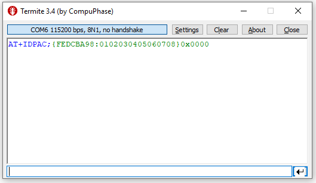
</div>
<div align="center"> Figure 2.4 - AT+IDPAC command example. </div>

<br/>

<br/>
<hr>

<a name="cfgrcz"></a>

### AT+CFGRCZ

```
AT+CFGRCZ=<SIGFOX_REGION>;
```

Open SigFox library and configure the device output power according to the region. The "SIGFOX_REGION" parameter can be one of the values below:

<div align="center"> Table 4.4 - CFGRCZ parameters. </div>
<div align="center">

| Sigfox Region | **Parameter Value** | Details |
|:-----:|:----:|:----:|
| RC1 | 1 | RC1 set up. |
| RC2 | 2 | RC2 set up. |
| RC3 | 3 | RC3 set up. |
| RC4 | 4 | RC4 set up. |
| RC5 | 5 | RC5 set up. |
| RC6 | 6 | RC6 set up. |
| RC7 | 7 | RC7 set up. |

</div>

#### > Examples: 

* Setting up device to work in RC2: 

```
AT+CFGRCZ=2;
```

<div align="center">
    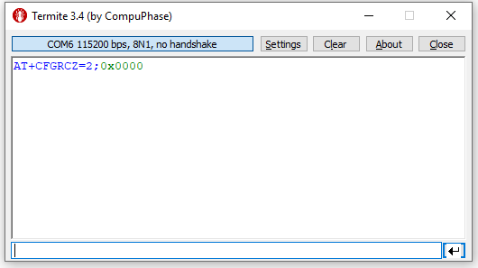
</div>
<div align="center"> Figure 3.4 - AT+CFGRCZ configuring device to RC2. </div>

<hr>

<a name="send"></a>

### AT+SEND

```
AT+SEND=<DOWNLINK_FLAG>:<PAYLOAD_DATA>;
```

Send a message to the Sigfox Network. This command **MUST BE** used **ONLY** after **AT+CFGRCZ**! 

#### > Parameters: 

> 1. DOWNLINK_FLAG: 1 or 0. If 1, ask a Sigfox base station to send a downlink data. If 0, send a frame to the Sigfox network without asking for a downlink.
> 2. PAYLOAD_DATA: Payload that will be sent to the Sigfox network.**THESE VALUES MUST BE ONLY HEXADECIMAL NUMBERS!** 

#### > Command Return: 

If the device did not ask for a downlink, this command will return only 7 bytes of error code. Otherwise, if a downlink is received, this command will return 25 bytes: the downlink data converted to ASCII + '{' '}' characters + 7 bytes of error code + '\n'.

<br/>

#### > Examples: 

* Sending a frame without asking for a downlink:

```
AT+SEND=0:00112233445566778899AABB;
```

<div align="center">
    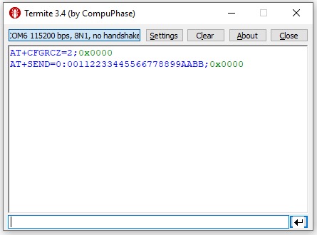
</div>
<div align="center"> Figure 4.4 - Sending a frame without asking for a downlink. </div>

<br/>

* Downlink example:

```
AT+SEND=1:00112233445566778899AABB;
```

<div align="center">
    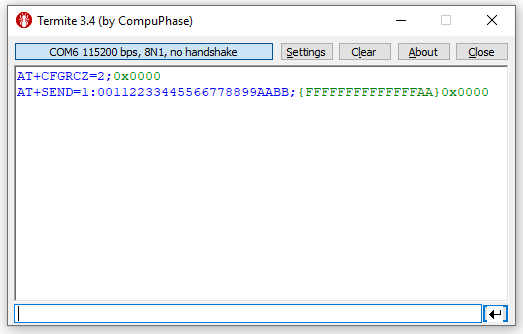
</div>
<div align="center"> Figure 5.4 - Sending a frame and receiving a downlink. </div>

<br/>

<div align="center">
  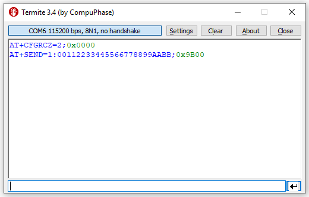
</div>
<div align="center"> Figure 6.4 - Sending a frame asking for a downlink but not receiving (timeout error). </div>

<br/>

**Note:** Sigfox base stations can take up to 30s to send a downlink.

<br/>
<hr>

<a name="sendcrc"></a>

### AT+SENDCRC

```
AT+SENDCRC=<DOWNLINK_FLAG>:<PAYLOAD_DATA>:<CRC32>;
```

Check the CRC of the received payload before transmitting the Sigfox message. This command **MUST BE** used **ONLY** after **AT+CFGRCZ**! 

#### > CRC specifications: 

* Polynomial: 0x04C11DB7. <br/>
* Length: 32 bit. <br/>
* Init Value: 0xFFFFFFFF. <br/>

#### > Parameters: 

> 1. DOWNLINK_FLAG: 1 or 0. If 1, ask a Sigfox base station to send a downlink data. If 0, send a frame to the Sigfox network without asking for a downlink.
> 2. PAYLOAD_DATA: Payload that will be sent to the Sigfox network. **THESE VALUES MUST BE ONLY HEXADECIMAL NUMBERS!** 
> 3. CRC32: 32 bit CRC of the respective payload.

#### > Examples: 

* Sending a frame without asking for a downlink and adding a CRC of 32 bit at the end of the string:

```
AT+SENDCRC=0:00112233445566778899AABB:3138A376;
```

<br/>

<div align="center">
    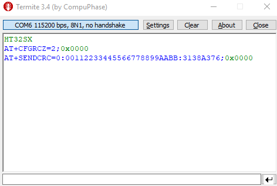
</div>
<div align="center"> Figure 7.4 - Sending a payload checked with a CRC32 without asking for a downlink. </div>

<br/>

* **WARNING:** The CRC value must be calculated with the payload converted to ASCII. The example below shows how to calculate CRC using an online calculator:

Online calculator: https://crccalc.com

<div align="center">
    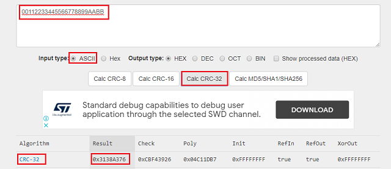
</div>
<div align="center"> Figure 8.4 - Calculating the CRC32 of a payload with an online calculator. </div>

<br/>
<hr>

<a name="monarch"></a>

### AT+MONARCH

```
AT+MONARCH=<RCZ_BEACON>:<TIMEOUT>;
```

Scan for a monarch beacon. 

#### > Parameters:

> 1. RC_BEACON: Tells which Sigfox region will be scanned. This parameter can be one of the values below:

<div align="center"> Table 5.4 - MONARCH parameters. </div>
<div align="center">

| Sigfox Region | **Parameter Value** | Details |
|:-----:|:----:|:----:|
| RC1 | 1 | Scan a RC1 beacon. |
| RC2 | 2 | Scan a RC2 beacon. |
| RC3 | 3 | Scan a RC3 beacon. |
| RC4 | 4 | Scan a RC4 beacon. |
| RC5 | 5 | Scan a RC5 beacon. |
| RC6 | 6 | Scan a RC6 beacon. |
| RC7 | 7 | Scan a RC7 beacon. |
| **ALL_REGIONS** | **127** | **Scan for any monarch beacon.** |

</div>

> 2. TIMEOUT: Monarch scan timeout in minutes. Should be more or equal than 5 minutes.

#### > Command Return:
This command will return 15 bytes: 7 bytes of error code + 7 bytes of monarch data + '\n' character. The monarch data format is shown below:

<div align="center"> 

{<RSSI_VALUE>:<RC_FOUND>} 

</div>


#### > Examples: 

* Scanning all Sigfox regions:

```
AT+MONARCH=127:6;
```

<div align="center">
  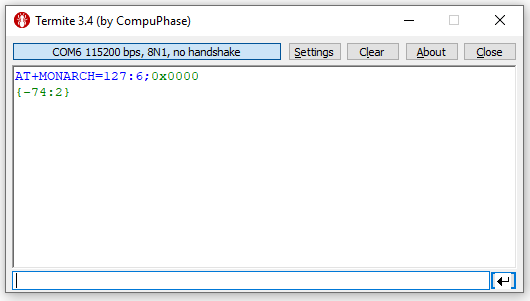
</div>
<div align="center"> Figure 9.4 - Scanning any monarch beacon. </div>

* Scanning a single region (RC2):

```
AT+MONARCH=2:6;
```

<div align="center">
  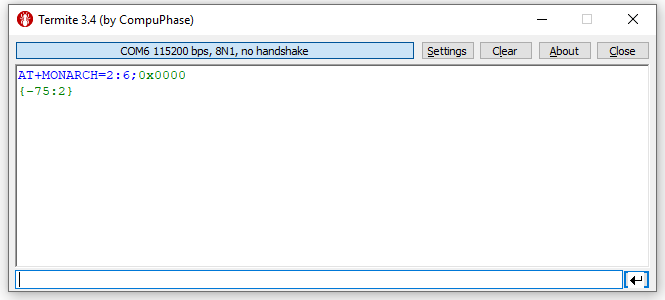
</div>
<div align="center"> Figure 10.4 - Scanning a single monarch region. </div>

<br/>
<hr>

<a name="deepsleep"></a>

### AT+DEEPSLEEP

```
AT+DEEPSLEEP;
```

Set up device to deep sleep mode.

#### > Deep Sleep Options

> 1. Push Button: By default, this application will configure the device to wake up after a falling down edge in PA6 (user button in the [HT32SX Development Kit](https://github.com/htmicron/ht32sx/tree/documents/Evaluation%20Board%20V2.0)). <br/><br/> **Current Consumption:** About 3.5 uA.

> 2. Wake up Pin: This sleep mode configures the device to the most low power state (standby mode) that can be only awake by a rise edge in PA0 (wake up pin). <br/><br/>**Current Consumption:** About 3.1 uA.<br/><br/> Follow the steps below in order to change set up your device to this sleep mode:
>> 1. Clone the [master_2](https://github.com/htmicron/ht32sx/tree/master_2) branch from our [GitHub](https://github.com/htmicron/ht32sx/tree/startPage) page.
>> 2. Open the AT_Commands source code and go to HT_API/HT_mcu_api.h file.
>> 3. Change the __STANDBY_MODE__ constant to 1:
>> <center> 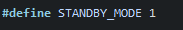 <center/>

<br/>
<hr>

<a name="anatel_details"></a>

## 5 - Anatel Test Details

This section describes the commands implemented for the Anatel certification process. It is applied only for RC2. 

<br/>

<div align="center">

| :warning: **WARNING:** Information herein contained are for informational purposes only and HT Micron assumes no responsibility for errors in Anatel Tests or any other specific country regulatory tests. HT Micron assumes no liability for customer product applications, design or damage to any equipment resulting from the use of HT Micron products outside of specifications and parameters. |
| --- |

</div>

<br/>

Here are a possible sequence of testing that can be done using the available commands. All of these commands can be stopped by pressing the user button connected in PA6 (HT32SX Development Kit):

1. Reset the DUT pressing the reset button.
2. Send "AT+TESTCRED=1;" to start the test mode.
3. Send "AT+CFGRCZ=2;" to configure the radio to the respective region.
4. Send "AT+REDUCEPOWER=-30;" to increase the output power.
5. Send "AT+CTMICRO=2;" to start the continuous transmission in a microchannel. The parameter can vary from 1 to 54 (please check Table 1.5).
6. Press the user button to stop the test.
7. Send "AT+CTMACRO=1;" to start a continuous transmission in a macrochannel. The parameter can vary from 1 to 9 (please check Table 1.5).
8. Press the user button to stop the test.
9. Send "AT+FREQPHOPP;" to start the frequency hopping test.
10. Press the user button to stop the test.

<br/>

<div align="center"> Table 1.5 - Micro and macro channels table. </div>
<div align="center">

|Micro Channel 1 (MHz) |Micro Channel 2 (MHz) |Micro Channel 3 (MHz) |Micro Channel 4 (MHz) |Micro Channel 5 (MHz) | Micro Channel 6 (MHz) |
|:-----:|:----:|:----:|:----:|:----:|:----:|
| 902.1375 | 902.1625 | 902.1875 | 902.2125 | 902.2375 | 902.2625 |
| 902.4375 | 902.4625 | 902.4875 | 902.5125 | 902.5375 | 902.5625 |
| 902.7375 | 902.7625 | 902.7875 | 902.8125 | 902.8375 | 902.8625 |
| 903.0375 | 903.0625 | 903.0875 | 903.1125 | 903.1375 | 903.1625 |
| 903.3375 | 903.3625 | 903.3875 | 903.4125 | 903.4375 | 903.4625 |
| 903.6375 | 903.6625 | 903.6875 | 903.7125 | 903.7375 | 903.7625 |
| 903.9375 | 903.9625 | 903.9875 | 904.0125 | 904.0375 | 904.0625 |
| 904.2375 | 904.2625 | 904.2875 | 904.3125 | 904.3375 | 904.3625 |
| 904.5375 | 904.5625 | 904.5875 | 904.6125 | 904.6375 | 904.6625 |

</div>

## Extra Documentation

Datasheets and application notes can be found at the [HT32SX Repository](https://github.com/htmicron/ht32sx).

## Contact Information

Head Office – São Leopoldo, RS <br/>
HT Micron Semiconductors <br/>
Unisinos Avenue, 1550 <br/>
São Leopoldo - RS <br/>
ZIP 93022-750 <br/>
Brazil <br/>
Tel: +55 51 3081-8650 <br/>
E-mail (Support): support_iot@htmicron.com.br <br/>
E-mail (General Enquiries): htmicron@htmicron.com.br <br/>