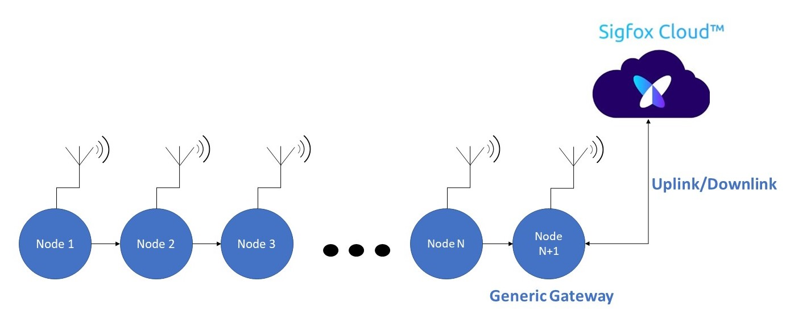
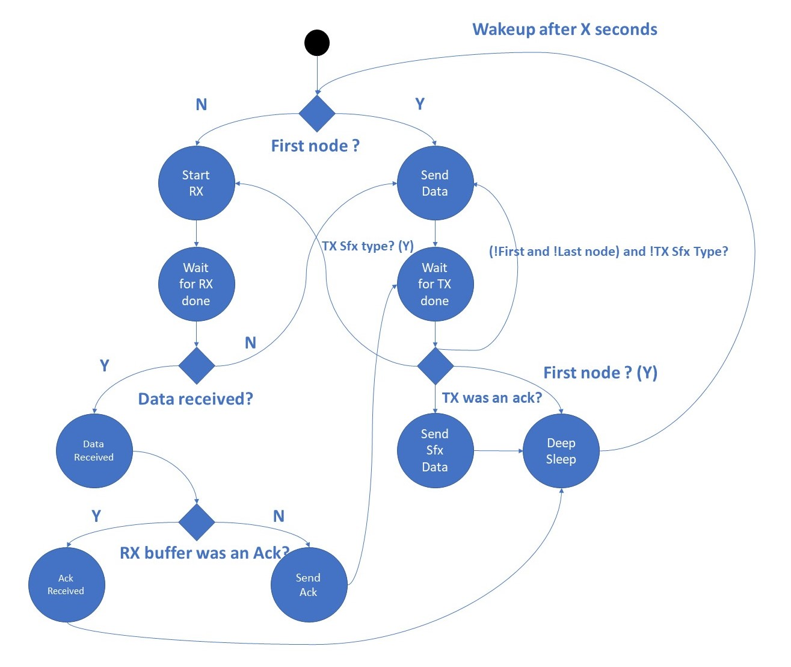
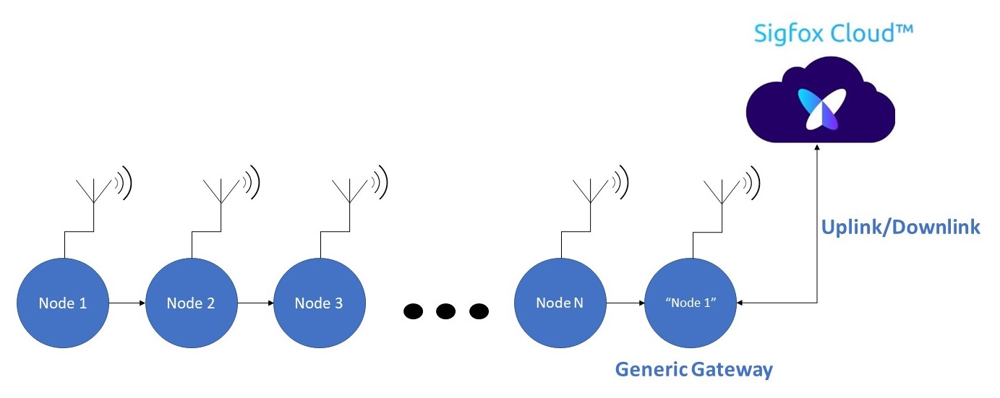
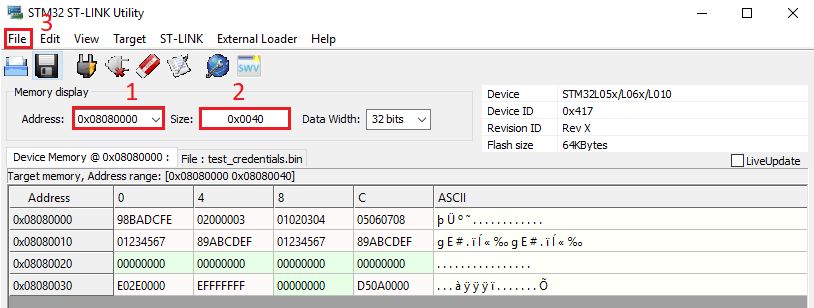
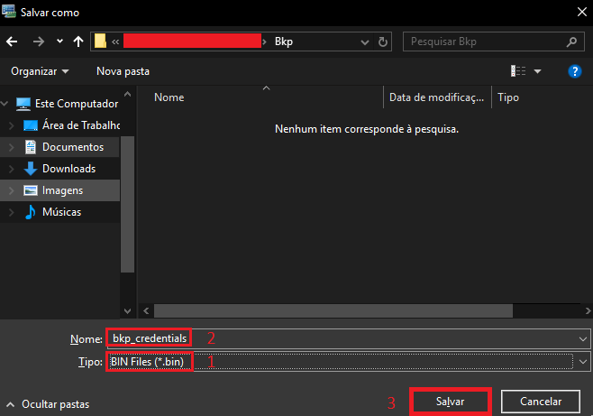
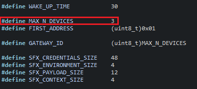
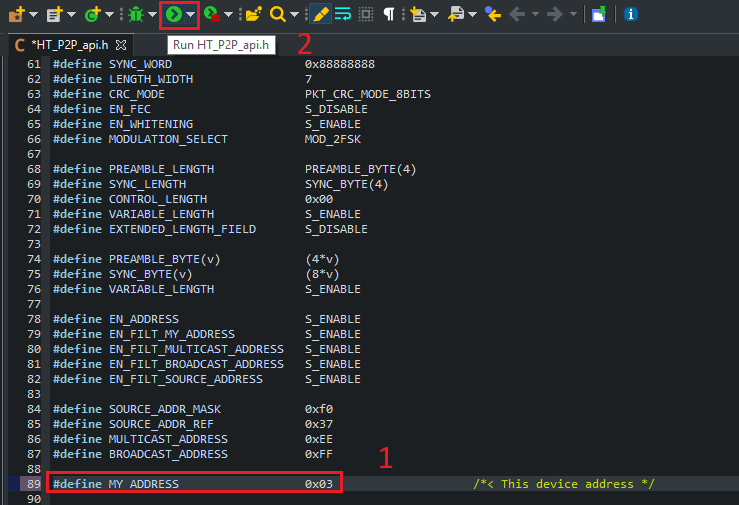
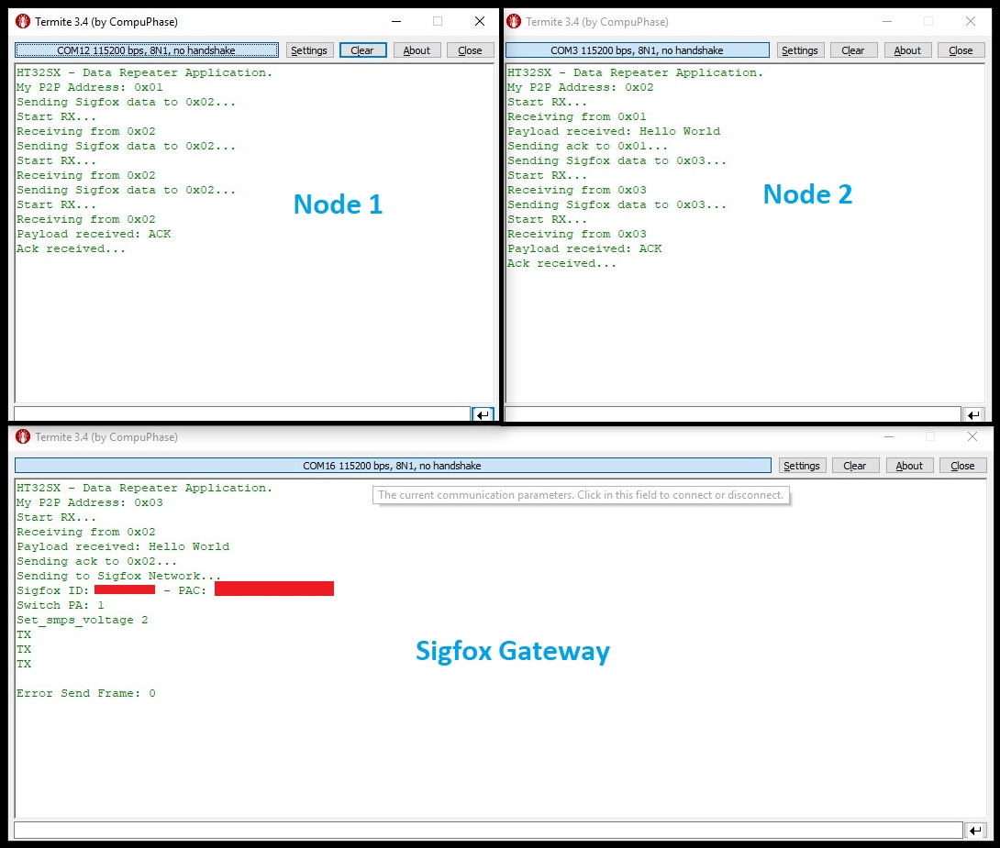
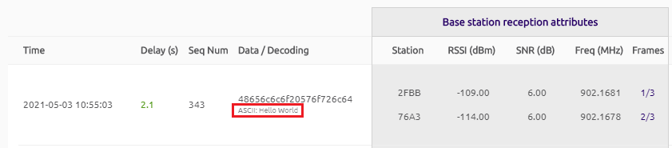

# HT32SX-P2P-Sigfox_Generic

## P2P + Generic Sigfox Gateway

P2P+Sigfox is an **EXAMPLE of application** that includes two **TOTALLY DIFFERENT** protocols (P2P and Sigfox) in a single solution. Embedded in a Peer-to-peer topology, the goal is repeat a 12 bytes payload from an iMCP located in a place with no Sigfox coverage (a farm or any indoor solution), to another iMCP located in a better position. 

Through this application, users will be able to create their own protocol or network, using HT32SX devices, with a **generic** Sigfox gateway.

<hr>

## Application Description

P2P + Generic Sigfox Gateway implements a simple Peer-to-Peer topology which has a generic Sigfox gateway at the end of nodes. Figure 1 shows how it works:

<br/>

<div align="center">
  
</div>
 <div align="center"> Figure 1 - P2P + Generic Sigfox Gateway topology. </div>

<br/>

This example was modulated using the Finite State Machine shown below:

<div align="center">
  
</div>
<div align="center"> Figure 2 - P2P + Generic Sigfox Gateway FSM. </div>

<br/>

In short, the first node will start sending a frame (it could be a temperature data of some sensor or anything else) to its neighbor and will wait until receive an acknowledge. The next nodes will receive its frames from its previous neighbor, send an acknowledge and then will forward that payload to the next node, until it arrives to a generic gateway, which will send that information to Sigfox Network.

The topology drawn in Figure 1 was developed using a very simple and naive algorithm: Node N+1 will be the first one to wake up , Node N the second one and so on until Node 1. At the end, all nodes are expected to be awake before transmissions. This is totally configurable. Users could create and implement their own algorithm with a different and probably more intelligent logic.

The main difference between this application and the [P2P+Sigfox Application](../HT32SX_P2P_Sigfox), is directly related to the gateway functionality. The **P2P + Generic Sigfox Gateway** has a totally **generic** gateway. For example, looking at the Figure 1, if the node 1 forwards its payload through the P2P network, when it arrives at the gateway node, that gateway will transmit the Node 1 information to the Sigfox cloud, as if it were the Node 1. Figure 3 below shows how it works:

<div align="center">
  
</div>
<div align="center"> Figure 3 - Generic Sigfox Gateway sending a payload using Node 1 credentials. </div>

<br/>

As we can see, P2P + Generic Sigfox Gateway application works an extension of the Sigfox Network. It could be very useful for indoor monitoring and another several application which are embedded in places where there is low Sigfox coverage. 

<hr>

## Protocol

The payload is forwarded using a proprietary P2P protocol. It could uses a different modulation, different packet format, different baud rate and could even use a different frequency base (433 - 1055 MHz), if compared to Sigfox. **It means that a base station will never detect these messages.** 

This is a open source code. Users are responsible to change and adapt it to their own context. From this example, developers could easily implement their own topology, like a Star or Mesh Network, for example; could change the frequency base; digital modulation; output power etc.

More code details can be found reading the comments written in all header files available in this application.

<hr>

## Test Setup

This section describes the basic test setup to running this application.

* [Git](https://git-scm.com/downloads).
* [STM32CubeIDE](https://www.st.com/en/development-tools/stm32cubeide.html).
* RS232 terminal ([Termite](https://www.compuphase.com/software_termite.htm) is recommended).
* [ST-Link Debugger](https://www.st.com/en/development-tools/st-link-v2.html).
* At least 3 or more HT32SX devices.
* Antennas: One for each device. The antennas must be appropriate to the frequencies selected previously in the  code.
* FTDI (USB-Serial Converter): One for each device.

<hr>

## Running this application.

Testing with 3 nodes.

1. Clone this branch: <br/>

```
git clone --single-branch --branch master_2 https://github.com/htmicron/ht32sx.git 
```

2. Download and install [ST-LINK Utility](https://www.st.com/en/development-tools/stsw-link004.html).

    **The next steps (steps 3 to 5) are strongly recommended! It will create a binary file as a backup for the Sigfox credentials (ID and PAC) and the calibration values of your device.**

3. Open ST-LINK Utility and connect the device which is going to be the Sigfox gateway in your P2P topology. Please remember that STLINK and STM32CubeIDE use the SWD protocol to access and flash a new code to the device memory. If you do not know how to use it, please check our FAQ([Q17](https://github.com/htmicron/ht32sx/tree/faq#flashcode)). 

4. Click on "Connect to target", change the address field to 0x08080000, the size field to 0x40 and click on "File -> Save file as...":

<div align="center">
  
</div>
<div align="center"> Figure 4 - STLINK Utility. </div>

<br/>

5. Then, write a name for your binary file, select the "BIN Files" type and click on "Save":

<div align="center">
  
</div>
<div align="center"> Figure 5 - Saving the backup file. </div>

<br/>

6. Open HT32SX-P2P-Sigfox_Generic directory and then, double click on the **_.cproject_** file to open STM32CubeIDE.

7. Go to **HT_Data_Repeater/Inc** directory and open **HT_data_repeater.h** file. Then, change the **MAX_N_DEVICES** constant to 3:

<div align="center">
  
</div>
<div align="center"> Figure 6 - Maximum number of nodes. </div>

</br>
      
  * Theoretically, the current topology could handle with at least 253 nodes:  1 byte for address (255 without counting the zero address), minus the multicast and broadcast addresses.

8. Open **HT_P2P_API/P2P_API/Inc/HT_P2P_api.h** file and search for **"MY_ADDRESS"** define. Change this value to **0x03**, connect the device which is going to be your **GATEWAY** and click on **"Run"** (only if you are using a SWD interface, check FAQ([Q17](https://github.com/htmicron/ht32sx/tree/faq#flashcode)) for more information) to flash your code:

<div align="center">
  
</div>
<div align="center"> Figure 7 - Selecting gateway address. </div>

<br/>

  * **Please note that the largest address number will always be the Sigfox Gateway.**

9. Do the same with the 3 other devices, changing to its corresponding hex address (0x02, 0x01 in this order).

10. Open Termite and reset all devices, starting from the gateway (0x03).

11. Check if your messages are being transmitted from the first node until the last one:

<div align="center">
  
</div>
<div align="center"> Figure 8 - Termite setup. </div>

<br/>

12. Check if your gateway has forwarded the message to the Sigfox Backend:

<div align="center">
  
</div>
<div align="center"> Figure 9 - Message detected by Sigfox Backend. </div>

<br/>

<hr>

## Extra Documentation

Datasheets and application notes can be found at the [HT32SX Repository](https://github.com/htmicron/ht32sx).

<hr>

## Contact Information

Head Office – São Leopoldo, RS <br/>
HT Micron Semiconductors <br/>
Unisinos Avenue, 1550 <br/>
São Leopoldo - RS <br/>
ZIP 93022-750 <br/>
Brazil <br/>
Tel: +55 51 3081-8650 <br/>
E-mail (Support): support_iot@htmicron.com.br <br/>
E-mail (General Enquiries): htmicron@htmicron.com.br <br/>

<hr>