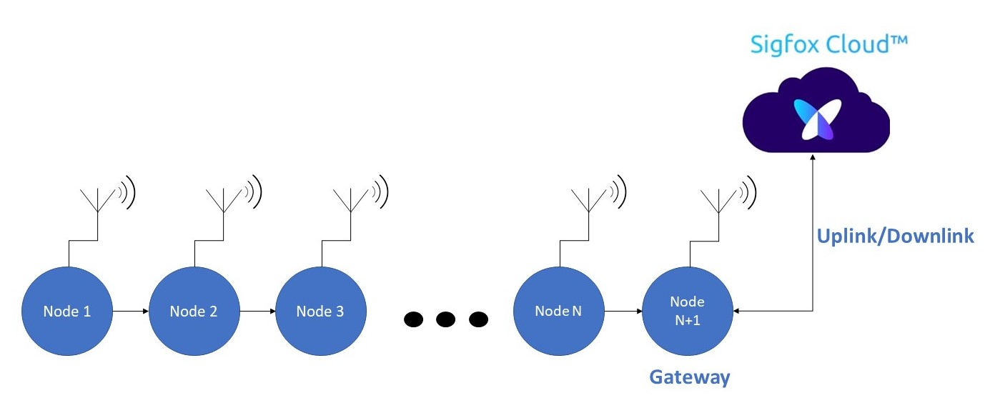
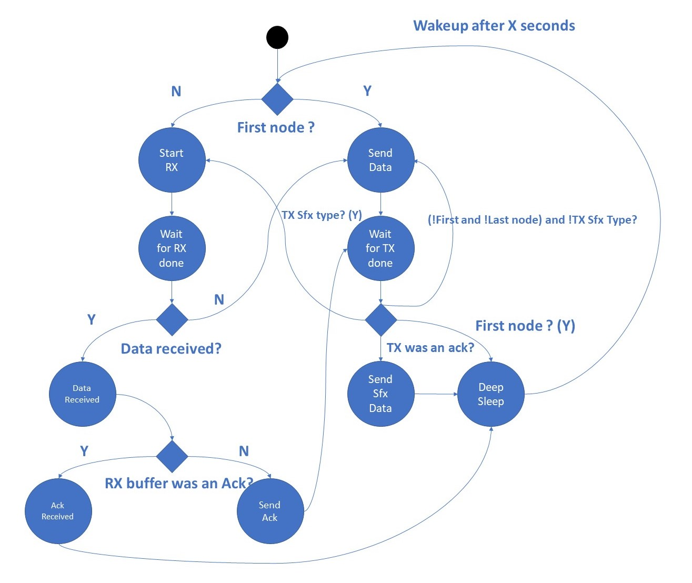
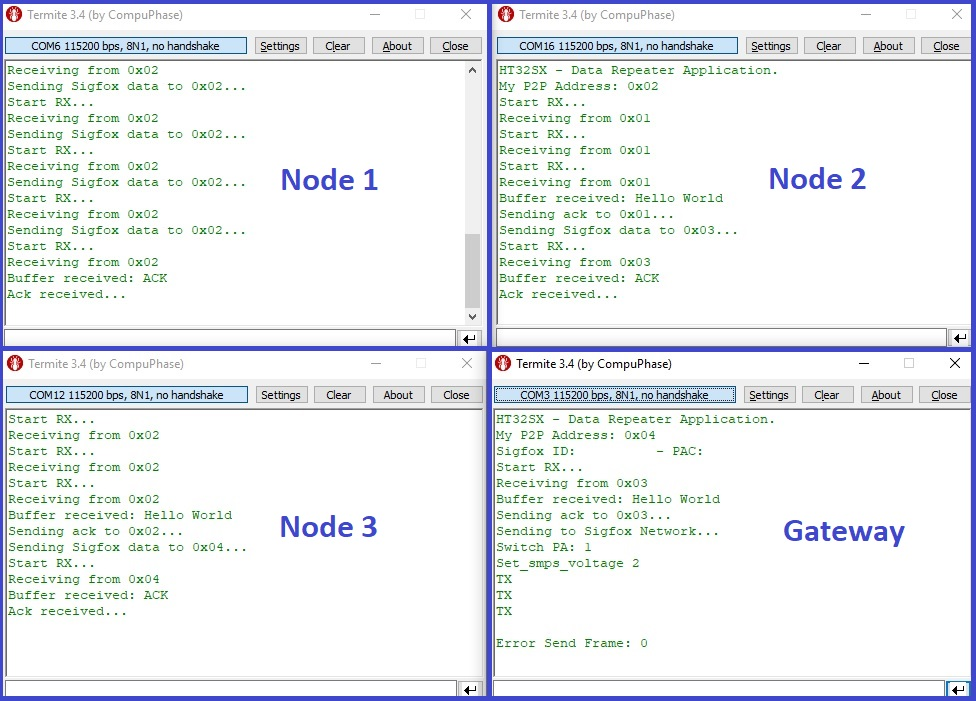
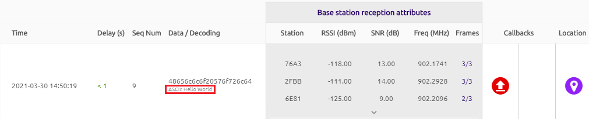

# HT32SX-P2P-Sigfox

## P2P + Sigfox Gateway 

P2P + Sigfox is an application based on Sigfox and Peer-to-Peer stack which provides a simple solution for data repeater using a P2P network.
Through this application, users will be able to create their own protocol or network with a Sigfox gateway.

## Application Description

P2P + Sigfox implements a simple Peer-to-Peer topology which has a Sigfox gateway at the end of nodes. Figure 1 shows how it works:

<br/>

<div align="center">
  
</div>
 <div align="center"> Figure 1 - P2P + Sigfox Gateway topology. </div>

<br/>

This example was modulated using the Finite State Machine shown below:

<div align="center">
  
</div>
<div align="center"> Figure 2 - P2P+Sigfox FSM. </div>

<br/>

In short, the first node will start sending a frame (it could be a temperature data of some sensor or anything else) to its neighbor and will wait until receive an acknowledge. The next nodes will receive its frames from its previous neighbor, send an acknowledge and then will forward that payload to the next node, until it arrives to the gateway, which is going to send that information to Sigfox Network.

More code details can be found reading the comments written in all header files available in this application.

## Test Setup

This section describes the basic test setup to running this application.

* [Git](https://git-scm.com/downloads).
* [STM32CubeIDE](https://www.st.com/en/development-tools/stm32cubeide.html).
* RS232 terminal ([Termite](https://www.compuphase.com/software_termite.htm) is recommended).
* [ST-Link Debugger](https://www.st.com/en/development-tools/st-link-v2.html).
* At least 3 or more HT32SX devices.
* Antennas: One for each device. The antennas must be appropriate to the frequencies selected previously in the  code.
* FTDI (USB-Serial Converter): One for each device.

# Executing

Testing with 4 nodes.

1. Clone this branch: <br/>

```
git clone --single-branch --branch master_2 https://github.com/htmicron/ht32sx.git 
```

2. Open HT32SX_P2P_Sigfox directory and then, double click on the **_.cproject_** file to open STM32CubeIDE.

3. Go to **HT_Data_Repeater/Inc** directory and open **HT_data_repeater.h** file. Then, change the **MAX_N_DEVICES** constant to 4 (maximum number of nodes in P2P network) and change the **GATEWAY_ID** to **0x04** (the last node will be the Sigfox Gateway):

<div align="center">
  
</div>
<div align="center"> Figure 3 - Changing maximum number of nodes. </div>

<br/>

4. Open **HT_P2P_API/P2P_API/Inc/HT_P2P_api.h** file and search for **"MY_ADDRESS"** define. Change this value to **0x04**, connect the device which is going to be your **GATEWAY** and click on **"Run"** to flash your code:

<div align="center">
  
</div>
<div align="center"> Figure 4 - Selecting gateway address. </div>

5. Do the same with the 3 other devices, changing to its corresponding hex address (0x03, 0x02, 0x01 in this order).

6. Open Termite and reset all devices, starting from the gateway (0x04).

7. Check if your messages are being transmitted from the first node until the last one, that is going to be the Sigfox Gateway:

<div align="center">
  
</div>
<div align="center"> Figure 5 - Termite setup. </div>

<br/>

8. Check if your gateway has forwarded the message to the Sigfox Backend:

<div align="center">
  
</div>
<div align="center"> Figure 6 - Message detected by Sigfox Backend. </div>

## Extra Documentation

Datasheets and application notes can be found at the [HT32SX Repository](https://github.com/htmicron/ht32sx).

## Contact Information

Head Office – São Leopoldo, RS <br/>
HT Micron Semiconductors <br/>
Unisinos Avenue, 1550 <br/>
São Leopoldo - RS <br/>
ZIP 93022-750 <br/>
Brazil <br/>
Tel: +55 51 3081-8650 <br/>
E-mail (Support): support_iot@htmicron.com.br <br/>
E-mail (General Enquiries): htmicron@htmicron.com.b <br/>
