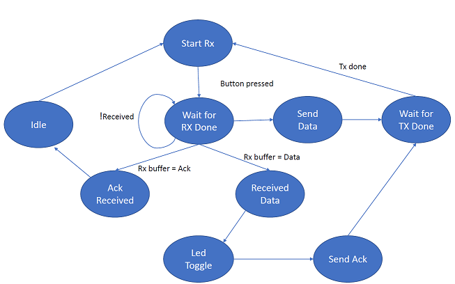

# HT32SX-P2P-Demo

## P2P Demo Application

P2P Demo Application is a new HT32SX functionality which provides a simple way to exchange message Peer-to-Peer between two or more different iMCPs, using S2LP Basic Protocol.
Through this application, users will be able to create their own protocol and Wireless network.

## Application Description

P2P Demo Application starts configuring some necessary peripherals, like USART1 (log purposes), GPIOs (button, led, radio interruption, etc.) and SPI (interface to send commands to S2LP). Then, a Finite State Machine, responsible to menage the whole application, starts running. All states are triggered by two external interruptions:

* User Button – PB0: Trigger FSM to Send Data state.
* Radio IT - PB2: Trigger FSM to Data Received state or finishes to transmit a data when FSM is waiting for a TX be done.

<br/>

 
 <div align="center"> Finite State Machine Diagram. </div>

<div align="center">
  
</div>

<br/>

More code details can be found reading the comments written in all header files available in this application.

## Test Setup

This section describes the basic test setup to running this application.

* [Git](https://git-scm.com/downloads).
* [STM32CubeIDE](https://www.st.com/en/development-tools/stm32cubeide.html).
* RS232 terminal ([Termite](https://www.compuphase.com/software_termite.htm) is recommended).
* [ST-Link Debugger](https://www.st.com/en/development-tools/st-link-v2.html) to flash a firmware.
* Button (must be in PB0 pin).
* Led (PA5 pin).
* 2 or more HT32SX devices.
* 2 or more atennas (one for each device).
* 2 or more FTDI (usb-serial converter – one for each device).

# Executing

1. Clone the master branch related to the hardware version 2.2: <br/>

```
git clone --single-branch --branch master_2 https://github.com/htmicron/ht32sx.git 
```

2. Open HT32SX_P2P_Demo directory and then, double click .cproject file to open STM32CubeIDE. 
3. Click *Run* to compile and flash the new firmware into your device: <br/>

<div align="center">
  
</div>

<br/>

4. Open Termite and reset your device to check if the initial string was printed on serial. <br/>

<div align="center">
  
</div>

5. Do the same (steps 3 and 4) with other devices that is going to be part of this test.
6. Press the button of one of tested devices and check if the message “Hello, World!” will be shown in the other terminal:

<div align="center">
  
</div>

<br/>

7. Check if the user led is blinking after receiving any message. <br/>

## Changing Destination/Source Address - Broadcast/Multicast Messages

- Changing destination or source address: <br/>
    - Open *HT_P2P_app.h* file and change *MY_ADDRESS* or *DESTINATION_ADDRESS* constants to the new value wanted (value must be less or equal than 1 byte).
- Sending broadcast and multicast messages: <br/>
    - Open *HT_P2P_app.c* file and change *S2LP_SetDestinationAddress* (located in *AppliSendBuff* function) argument to *BROADCAST_ADDRESS* or *MULTICAST_ADDRESS* defines. Example:

<div align="center">
  
</div>

## Extra Documentation

Datasheets and application notes can be found at the [HT32SX Repository](https://github.com/htmicron/ht32sx).

## References

For additional information about S2LP or even more applications developed with this transceiver, check [S2LP Datasheet](https://www.st.com/resource/en/datasheet/s2-lp.pdf) and the [UM1904](https://www.st.com/resource/en/user_manual/dm00189294-getting-started-with-xcubesubg1-sub1-ghz-rf-software-expansion-for-stm32cube-stmicroelectronics.pdf) user manual written by STMicroelectronics.


## Contact Information

Head Office – São Leopoldo, RS <br/>
HT Micron Semiconductors <br/>
Unisinos Avenue, 1550 <br/>
São Leopoldo - RS <br/>
ZIP 93022-750 <br/>
Brazil <br/>
Tel: +55 51 3081-8650 <br/>
E-mail (Support): support_iot@htmicron.com.br <br/>
E-mail (General Enquiries): htmicron@htmicron.com.b <br/>
